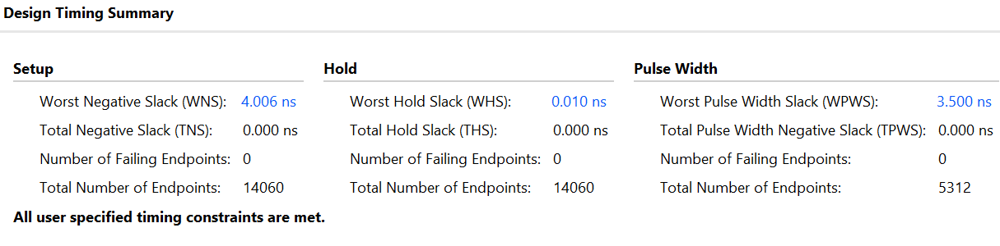
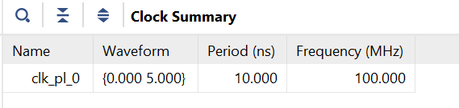
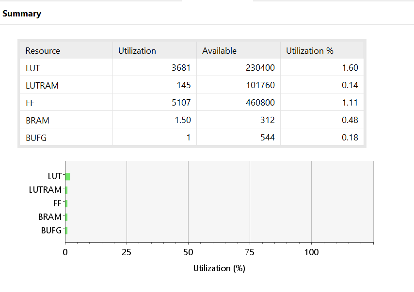
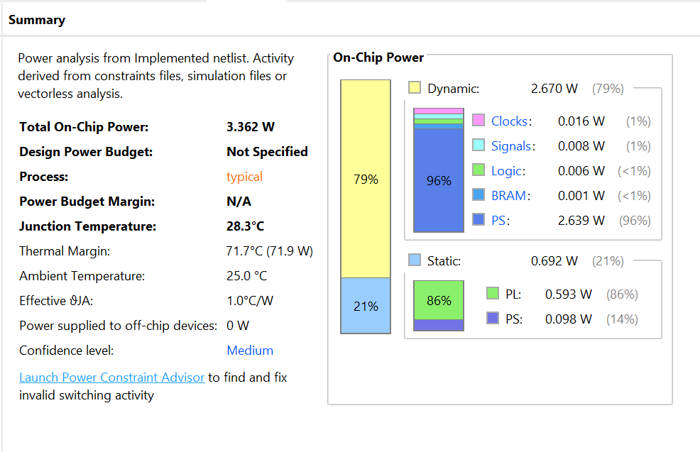
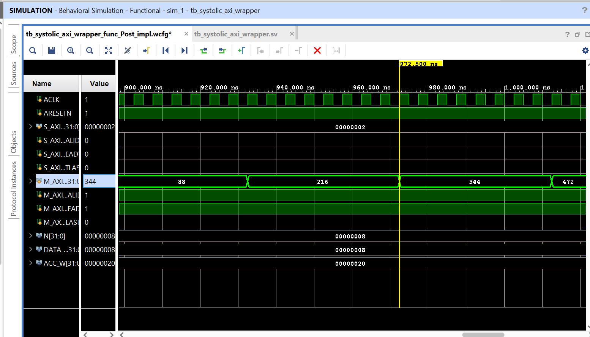
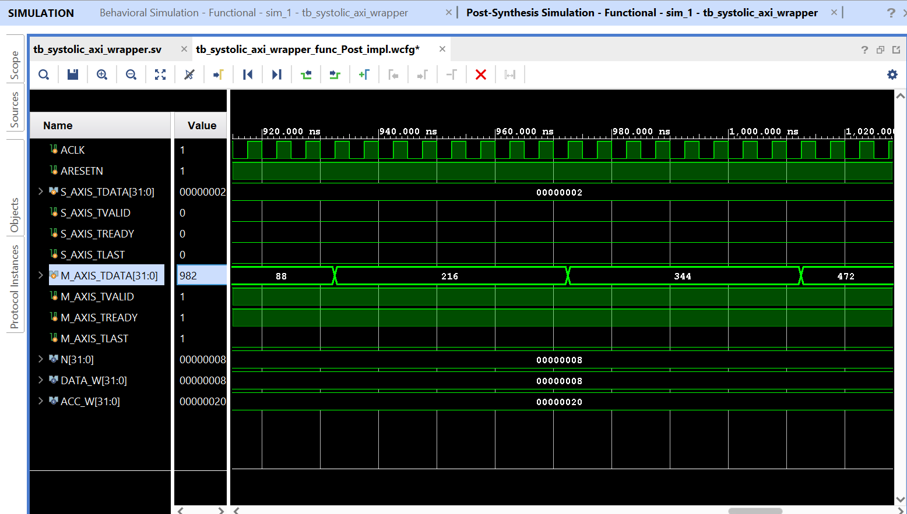
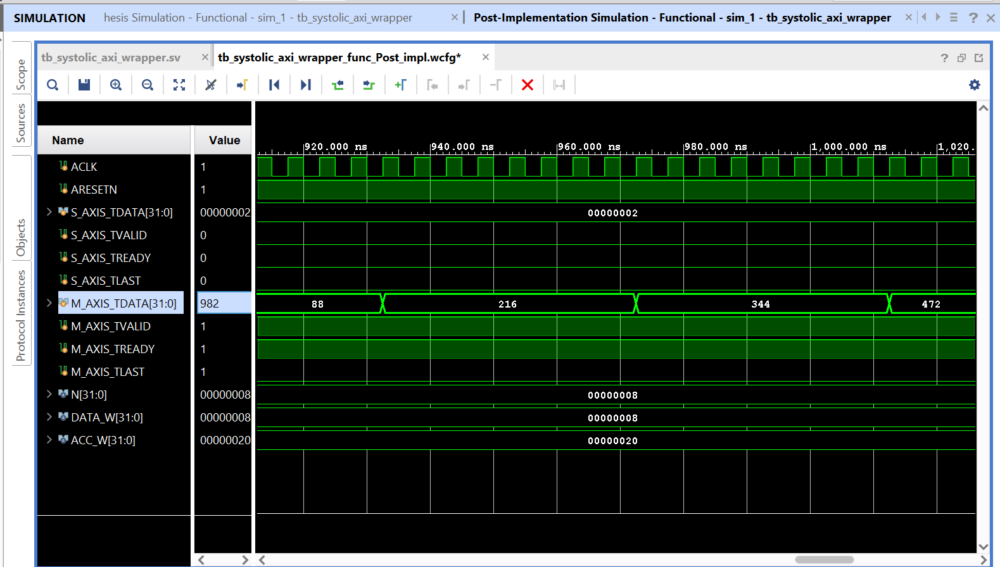

# 8×8 Systolic Array AI Accelerator — Zynq UltraScale+ ZCU104

A fully parameterized 8×8 systolic array matrix multiplier implemented in 
SystemVerilog on Xilinx Zynq UltraScale+ ZCU104, targeting INT8 matrix 
multiplication for transformer inference acceleration.

---

## Key Results

| Metric | Value |
|--------|-------|
| Target Frequency | 100 MHz |
| Worst Negative Slack (WNS) | +4.006 ns |
| Worst Hold Slack (WHS) | +0.010 ns |
| Failing Endpoints | 0 / 14,060 |
| LUT Utilization | 3,681 (1.60%) |
| Flip Flops | 5,107 (1.11%) |
| Total On-Chip Power | 3.362 W |
| PL Logic Power | 6 mW |
| PS Power | 2.639 W |

---

## Architecture

### Processing Element (PE)
Single-cycle INT8 MAC unit — the core building block:
```
psum <= psum + (a_in * b_in)
```
Each PE:
- Accepts 8-bit inputs a_in, b_in with valid signals
- Accumulates partial sum in 32-bit register
- Passes data to neighboring PEs every clock cycle

### Systolic Array — Wave-Skew Dataflow
```
A[0] →  PE(0,0) → PE(0,1) → PE(0,2) → ...
         ↓          ↓          ↓
A[1] →  PE(1,0) → PE(1,1) → PE(1,2) → ...
         ↓          ↓          ↓
        ...
B[0]    B[1]       B[2]
 ↓       ↓          ↓
```
- Row data flows left to right
- Column data flows top to bottom
- Each PE accumulates its partial product independently

### AXI-Stream FSM Controller
3-state FSM for PS-PL data transfer:
```
LOADING → COMPUTING → STREAMING
```
- Integrates with Xilinx AXI DMA IP
- Zero-copy data transfer between ARM PS and PL fabric

---

## Block Design

Zynq PS → AXI Interconnect → AXI DMA → systolic_axi_top

Full block design available in `bd/design_1.bd`

---

## Implementation Results

### Timing


### Clock


### Resource Utilization


### Power


> **Note:** Total power is dominated by Zynq PS at 2.639W.
> PL logic (the actual systolic array) consumes only **6mW**.

---

## Simulation Results

### Behavioral Simulation


### Post-Synthesis Functional Simulation


### Post-Implementation Functional Simulation


---

## Repository Structure
```
systolic_array_fpga/
├── rtl/
│   ├── PE.v                  # Single-cycle INT8 MAC Processing Element
│   ├── systolic_nxn_array.v  # Parameterized NxN systolic array
│   ├── systolic_controller.sv# AXI-Stream FSM — Load→Compute→Stream
│   ├── systolic_top.sv       # Top-level — array + controller
│   ├── systolic_axi_wrapper.sv# AXI-Stream interface wrapper
│   └── systolic_axi_top.v   # Verilog top for IP packaging
├── tb/
│   ├── tb_PE.v               # PE unit testbench
│   ├── tb_systolic_2x2.v     # 2×2 array testbench
│   ├── tb_systolic_nxn.v     # NxN array testbench
│   ├── tb_systolic_top.sv    # Top-level testbench
│   └── tb_systolic_axi_wrapper.sv # AXI wrapper testbench
├── bd/
│   └── design_1.bd           # Vivado block design
├── docs/
│   ├── timing.png            # Timing summary
│   ├── power.png             # Power report
│   ├── utilization.png       # Resource utilization
│   ├── clock.png             # Clock summary
│   ├── sim_behavioral.png    # Behavioral simulation
│   ├── sim_post_synthesis.png# Post-synthesis simulation
│   └── sim_post_implementation.png # Post-implementation simulation
└── .gitignore
```

---

## Tools Used

| Tool | Version | Purpose |
|------|---------|---------|
| Xilinx Vivado | 2023.2 | Synthesis, Implementation, Simulation |
| Xilinx XSim | 2023.2 | Behavioral and post-implementation simulation |
| Zynq UltraScale+ | xczu7ev-ffvc1156-2-e | Target device |

---

## About

This project demonstrates complete FPGA design flow — RTL design, 
IP integration via block design, timing closure, and three-stage 
simulation verification (behavioral, post-synthesis, post-implementation).

**Author:** Anil Sanneboyina
**LinkedIn:** [linkedin.com/in/sanneboyina-anil](https://linkedin.com/in/sanneboyina-anil)
**ASIC Implementation:** [pe-asic-sky130](https://github.com/AnilS454/pe-asic-sky130)
